# Brick Towers Midnight Identity

Welcome to the Zero Knowledge proof-based Identity Verification solution by Brick Towers.
This platform is built on Midnight Blockchain ZK technology and showcases privacy-preserving identity attribute verification for real-world applications.

## 📖 Overview

Brick Towers Midnight Identity is a privacy-focused identity verification solution that leverages Zero-Knowledge proofs to enable secure verification of personal information without revealing the actual data.
The system allows users to provide proof of age or other identity attributes while maintaining complete privacy of their personal information.

### ✅ Key Features

- 💡 **Midnight Wallet Integration**: Users can link their identity credentials to their Midnight wallet
- 💡 **Decentralized Identity Management**: Users own and control their identity credentials
- 💡 **Privacy-Preserving Identity Verification**: Verify age and other identity attributes without exposing the actual data to 3rd parties
- 💡 **Secure Signature Verification**: Cryptographic signatures of trusted issuers ensure the authenticity of identity claims
- 💡 **Integration with Midnight Blockchain**: Built on top of Midnight's Zero-Knowledge infrastructure
- 💡 **Practical Use Cases**: Real-world demonstration through an age-gated wine shop application

### 🛠 Technical Features

- **React Frontend**: Modern UI built with React and Material-UI
- 💡 **Faucet**: Obtain tBTC directly from the game page.
- 💡 **Wallet Feedback**: Detailed feedback on wallet connection status.
- 💡 **Transaction Feedback**: Step-by-step updates during transaction processing.
- 💡 **Error Handling**: Clear error messages for common issues.
- 💡 **Retry Logic**: Resilience against transient failures in public providers.
- 💡 **State Recovery**: Improved state recovery mechanism for transient failures and browser reloads.
- 💡 **Firebase**: Signature registry changes are published to Firebase.
- 💡 **Indexer**: Indexer is monitoring the blockchain using Midnight indexer and publishes information about relevant signature registry changes.
-

## 📝 Contract Features

- 💡**Signing Key Registration**: Users can register their signing keys on the blockchain
- 💡**Identity Verification**: Verify user's age without revealing the actual date of birth
- 💡**Signature verification**: Verify ecliptic curve signatures of identity claims
- 💡**Coin Payments**: Users can pay for orders using tBTC coins
- 💡**Modularization**: Use modules for cryptographic functions

## 🍷 Wine Shop Use Case


The repository includes a complete demonstration of the identity verification system through a wine shop use case:

1. **Identity Verification**: Users only share their private data and verify their identity with a trusted Identity Provider (IDP)
2. **Age Verification**: The wine shop verifies the user is at least 21 years old without seeing their actual date of birth or any other personal information
3. **Secure Transactions**: Orders are processed with both payment and age verification in a single transaction, ensuring that only valid orders are registered
4. **Privacy Protection**: All sensitive data remains private, with only the necessary proofs shared on-chain

## 🔍 Technical Architecture

The solution consists of several components working together:

### Signing Key Registry

**Challenge:** Midnight Lace Wallet does not expose an API to neither to sign custom messages, nor derive signing keys from the wallet seed. This makes it impossible to sign messages with the wallet key directly.

**Solution:** The signing key registry contract allows users to link their wallet address to a signing key. This key can be used to sign messages and verify the authenticity of the user's identity.

### Identity Provider System

The identity provider provides an API service for users to privately verify their identity.
The identity provider issues signed verifyable credentials containing identity attributes, which can be used for verification in other applications.

### Wine Shop Application

- **Shop Contract**: Handles orders and age verification
- **Shop API**: Interfaces between the Web UI and the shop backend
- **Shop UI**: User interface for browsing and ordering wines

## 💻 How It Works

The system operates through the following workflow:

### Identity Registration and Verification

1. **Key Generation**: User generates a signing key pair and stores it privately
2. **Key Registration**: User registers their signing public key on the blockchain, linking it to their wallet address
3. **Identity Document Submission**: User submits identity documents (ID, proof of life video) to the Identity Provider
4. **Credential Issuance**: Identity Provider verifies documents and issues a signed credential containing identity attributes

### Wine Shop Order Process

1. **Product Selection**: User browses and selects wines in the shop UI
2. **Order Creation**: User creates an order with selected products and submits the details to the shop using an API
3. **Age Verification**: The contract privately verifies the user is over 21 and generates a ZK proof
4. **Payment Processing**: User submits a single transaction including the payment and the ZK proof
5. **Order Fulfillment**: Upon successful verification and payment, the order is confirmed

## 📋 Use Case Flow Details

```mermaid
sequenceDiagram
    actor User
    participant Signature DApp
    participant Signature Contract
    participant IDP as Identity Provider
    participant Shop DApp
    participant Contract as Shop Contract

    %% Identity registration phase
    User->>Signature DApp: 1. Connect wallet
    Note over User: 2. Generate signing key pair<br/>Store privately
    User->>Signature Contract: 3. Register wallet & signing public keys
    Note over IDP: 4. Generate signing key pair<br/>Publish public key
    IDP->>Signature Contract: Register IDP public key

    %% Identity verification phase
    User->>IDP: 5. Submit identity documents<br/>(ID, proof of life video)<br/>Signed with signing key
    IDP->>Signature Contract: Verify signature & resolve keys
    IDP->>User: 6. Issue signed credential<br/>(identity attributes + signature)
    Note over User: 7. Store credential privately

    %% Wine shop order phase
    User->>Shop DApp: 8. Connect wallet & browse products
    User->>Shop DApp: Select wines & create order
    Shop DApp->>User: Show order details
    User->>Contract: 9. Submit order with payment<br/>and identity credential

    Note over Contract: 10. Private verification:<br/>- Verify credential signature<br/>- Extract & verify age (≥21)<br/>- Verify payment
```



1. User connects wallet to the Identity DApp
2. User generates a signing key and stores it privately
3. User registers their wallet public key with the signing public key on the blockchain
4. Identity Provider (IDP) generates their own signing key and publishes their public key
5. User submits identity documents to IDP, signed with their signing key
6. IDP verifies the user's identity and issues a signed credential containing identity attributes
7. User stores the credential privately
8. User connects to the Wine Shop DApp and browses products
9. User creates an order and submits it through the contract
10. The contract privately verifies the user's age using the credential, without revealing the actual date of birth
11. If verification succeeds, the contract processes the payment and confirms the order

## 🛡️ Security Considerations

- All sensitive identity information remains private and is never exposed on-chain
- Zero-Knowledge proofs enable verification without revealing the underlying data
- Cryptographic signatures ensure the authenticity of identity claims
- Identity Provider reputation system ensures trustworthiness

## 🪛 Build

### Prerequisites

- [Midnight Compact compiler](https://docs.midnight.network/develop/tutorial/building/prereqs#midnight-compact-compiler)
- [Node.js](https://nodejs.org/en/download/) (LTS/hydrogen)
- [Yarn](https://yarnpkg.com/getting-started/install)
- [Docker](https://docs.docker.com/get-docker/)

```
yarn install
npx turbo build
```

## 🧪 Test

```
npx turbo test
```
